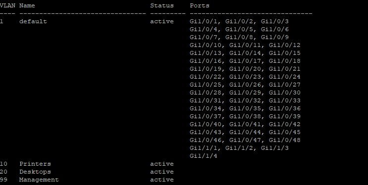
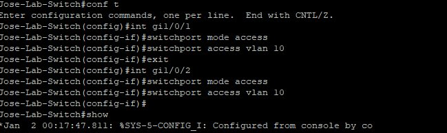
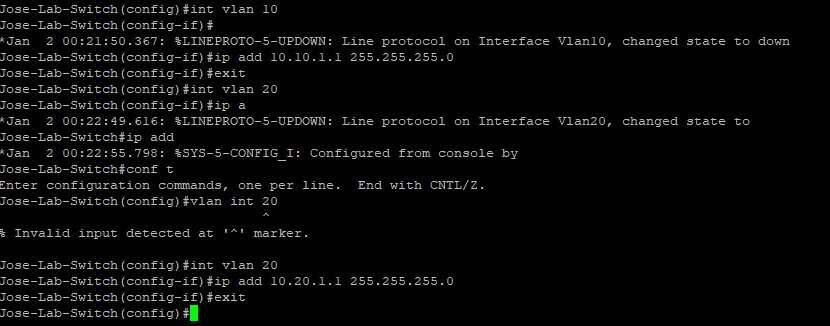

# Cisco Catalyst 3750-X — Initial Switch Configuration

Date: 2026-03-24

---

## 📌 Summary

Set up a borrowed Cisco Catalyst 3750-X Series switch as a homelab environment to practice enterprise switching concepts. Performed a full factory reset, configured VLANs, assigned access ports, created SVIs for inter-VLAN routing, and enabled Layer 3 routing. Documented for CCNA study and hands-on networking practice.

---

## 🖥️ Environment / Context

- **Device:** Cisco Catalyst 3750-X Series (48-port Gigabit, Layer 3)
- **IOS Version:** 15.2(4)E10 (`c3750e-universalk9-mz.152-4.E10.bin`)
- **Connection Method:** Console cable (USB to RJ45)
- **Location:** Home Lab
- **Terminal:** Serial console session

---

## ⚙️ Configuration

### VLANs

| VLAN | Name | Ports Assigned |
|------|------|----------------|
| 1 | default | All unassigned ports |
| 10 | Printers | Gi1/0/1 |
| 20 | Desktops | Gi1/0/2 |
| 99 | Management | None yet |

### SVIs (Layer 3 Virtual Interfaces)

| VLAN | IP Address | Subnet Mask |
|------|------------|-------------|
| 10 | 10.10.1.1 | 255.255.255.0 |
| 20 | 10.20.1.1 | 255.255.255.0 |

### Switch Identity

- **Hostname:** `Jose-Lab-Switch`
- **Enable Secret:** Configured (MD5 encrypted)
- **IP Routing:** Enabled

---

## 🔧 Steps Taken

1. Connected via console cable and entered privileged EXEC mode:
   ```
   Switch> enable
   ```

2. Disabled DNS lookup to prevent IOS from trying to resolve unknown commands as hostnames:
   ```
   Switch# no ip domain-lookup
   ```

3. Performed factory reset — erased startup config, deleted VLAN database, and reloaded:
   ```
   Switch# write erase
   Switch# delete flash:vlan.dat
   Switch# reload
   ```
   - Confirmed deletion and reload when prompted
   - Skipped initial configuration dialog on boot (`no`)

4. Entered global configuration mode and set hostname:
   ```
   Switch# conf t
   Switch(config)# hostname Jose-Lab-Switch
   ```

5. Set enable secret password:
   ```
   Jose-Lab-Switch(config)# enable secret [password]
   ```

6. Created VLANs and assigned names:
   ```
   Jose-Lab-Switch(config)# vlan 10
   Jose-Lab-Switch(config-vlan)# name Printers
   Jose-Lab-Switch(config)# vlan 20
   Jose-Lab-Switch(config-vlan)# name Desktops
   Jose-Lab-Switch(config)# vlan 99
   Jose-Lab-Switch(config-vlan)# name Management
   ```


7. Assigned ports to VLANs as access ports:
   ```
   Jose-Lab-Switch(config)# int gi1/0/1
   Jose-Lab-Switch(config-if)# switchport mode access
   Jose-Lab-Switch(config-if)# switchport access vlan 10

   Jose-Lab-Switch(config)# int gi1/0/2
   Jose-Lab-Switch(config-if)# switchport mode access
   Jose-Lab-Switch(config-if)# switchport access vlan 20
   ```




8. Created SVIs (Switched Virtual Interfaces) to give each VLAN a Layer 3 IP address:
   ```
   Jose-Lab-Switch(config)# int vlan 10
   Jose-Lab-Switch(config-if)# ip address 10.10.1.1 255.255.255.0

   Jose-Lab-Switch(config)# int vlan 20
   Jose-Lab-Switch(config-if)# ip address 10.20.1.1 255.255.255.0
   ```



9. Enabled IP routing for inter-VLAN routing:
   ```
   Jose-Lab-Switch(config)# ip routing
   ```

10. Verified configuration:
    ```
    Jose-Lab-Switch# show vlan b
    Jose-Lab-Switch# show ip route
    Jose-Lab-Switch# show mac address-table
    ```

11. Saved configuration to NVRAM:
    ```
    Jose-Lab-Switch# write memory
    ```

---

## 🚨 Troubleshooting / Notes

- **DNS lookup hanging on unknown commands** — IOS default behavior. Every unrecognized command gets treated as a hostname lookup. Fixed with `no ip domain-lookup`. Must be re-applied after every factory reset as it does not persist.
- **`show ip route` returned empty** — Expected. SVIs show as `down` because no devices were physically connected to the assigned ports. Routes only appear when the interface is `up/up`.
- **`%LINEPROTO-5-UPDOWN: Line protocol on Interface Vlan10, changed state to down`** — Normal. SVI comes up only when a live device is connected to a port in that VLAN.

---

## ✅ Outcome

- Cisco 3750-X successfully factory reset and reconfigured from scratch
- VLANs 10, 20, and 99 created and named
- Access ports assigned to Printers and Desktops VLANs
- SVIs configured with logical IP scheme (`10.x.1.1/24`)
- Layer 3 routing enabled
- Configuration saved and persists on reboot
- Clean baseline for continued homelab expansion

---

## 📚 References

- [Paolo Reyes On Youtube](https://www.youtube.com/@PaoloReyes1)

---

## 🔄 Corrections / Future Plans

- Assign ports and SVI to VLAN 99 (Management)
- Test inter-VLAN routing with two devices connected (need USB-C to RJ45 adapter)
- Configure port security on access ports
- Set up Syslog for switch logging
- Build full small business VLAN topology (Management, Users, Printers, Guest WiFi)
